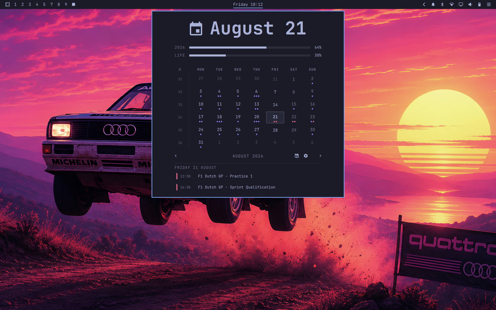

# My Clock for Omarchy

The Omarchy bar clock, upgraded: date and time on the bar, and a popup with
a month calendar, year/life progress bars, and your upcoming events from
any iCalendar (.ics) feed.



## Features

- **Bar** — date/time label (formats configurable), vertical-bar mode for
  thin setups
- **Popup**
  - Big hero date; click it or the month header to jump back to today
  - Month grid with ISO week numbers and event dots per day
  - Year progress ("2026 · 64%") and life progress (editable birth year /
    expectancy, double-click the year row)
  - Upcoming list and selected-day events from your calendars
- **Calendars** — paste any shared iCalendar link (Proton, Google,
  Nextcloud, Fastmail, self-hosted…). Reorder feeds with the arrows,
  recolor them by clicking a feed's dot. Recurring events expand
  correctly across DST changes; one broken event in a feed can't sink
  the rest.
- **Private by default** — feed URLs never appear in process arguments or
  logs; feeds and caches are owner-only

## Requirements

```bash
sudo pacman -S --needed python-icalendar python-recurring-ical-events
```

## Install

```bash
omarchy plugin add https://github.com/matteodevenuto/omarchy-myclock --enable
```

It replaces the stock clock widget in place. Click the clock to open the
panel; Escape closes it.

## Keyboard

| Key | Action |
|---|---|
| `←`/`→` | Previous / next month |
| `↑`/`↓` | Previous / next year |
| `t` / `enter` | Back to today |
| `s` | Show/hide calendars |
| `u` | Toggle upcoming list |
| `w` | Toggle week start |
| `esc` | Close |

## Settings

| Key | Type | Default | Meaning |
|---|---|---|---|
| `format` | string | locale | Bar date/time format (Qt format string) |
| `weekStartDay` | string | locale | First day of week |
| `birthYear` | integer | — | Life-progress start year |
| `lifeExpectancy` | integer | 90 | Life-progress span |
| `refreshIntervalSec` | integer | 900 | Calendar feed poll interval |
| `feedsFile` | path | — | Defaults to `~/.config/omarchy/calendars/feeds.json` |

## Credits

Built on the stock [Omarchy](https://omarchy.org/) clock plugin (MIT, by
the Omarchy authors). The calendar feed integration is based on
[Proton Calendar for
Omarchy](https://github.com/itsmoorgrove/omarchy-protoncalendar) by
[itsmoorgrove](https://github.com/itsmoorgrove) (MIT), generalized to any
iCalendar source. See [LICENSE](LICENSE).

## Removal

```bash
omarchy plugin remove matteodevenuto.clock
rm -rf ~/.config/omarchy/calendars ~/.cache/omarchy/calendars
```

Removing the clone restores the stock clock.
